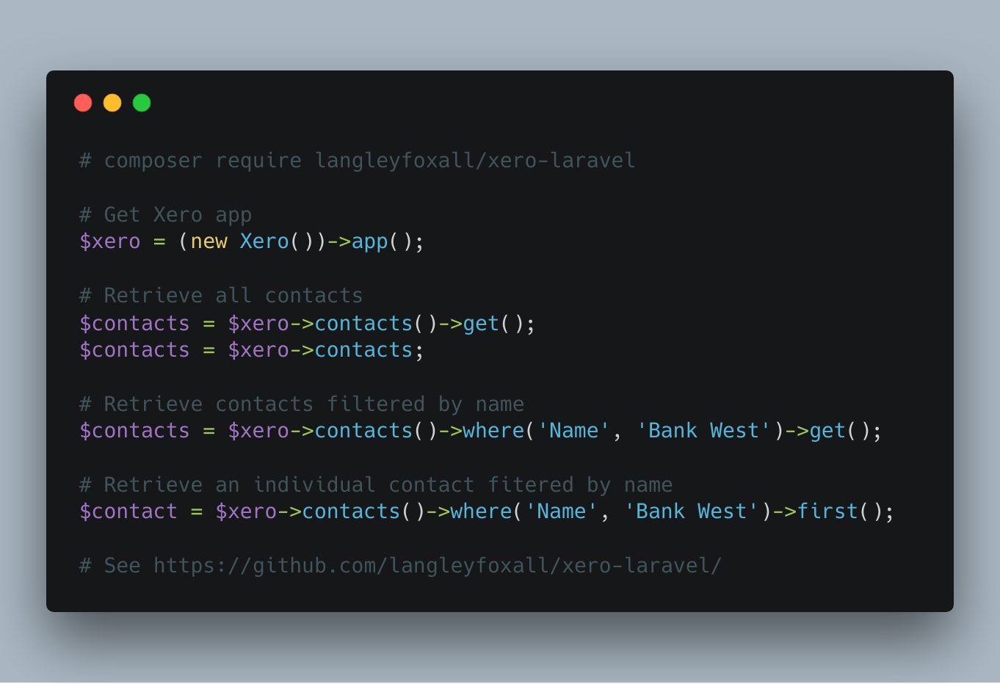

# 💸 Xero Laravel

Xero Laravel allows developers to access the Xero accounting system using 
an Eloquent-like syntax.

Please note that this version of Xero Laravel supports the Xero OAuth 2.0 
implementation. Older Xero apps using OAuth 1.x are no longer supported.

<p align="center">
    
</p>

<p align="center">
    <a href="https://github.styleci.io/repos/153256469">
        
    </a>
    <a href="https://packagist.org/packages/langleyfoxall/xero-laravel/stats">
        
    </a>
</p>

## Installation

Xero Laravel can be easily installed using Composer. Just run the following 
command from the root of your project.

```bash
composer require langleyfoxall/xero-laravel
```

If you have never used the Composer dependency manager before, head 
to the [Composer website](https://getcomposer.org/) for more information 
on how to get started.

## Setup

First, run the following `artisan` command from the root of your project. This
will publish the package configuration file.

```bash
php artisan vendor:publish --provider="LangleyFoxall\XeroLaravel\Providers\XeroLaravelServiceProvider"
```

You now need to populate the `config/xero-laravel-lf.php` file with the 
credentials for your Xero app(s). You can create apps and find the
required credentials in the [My Apps](https://developer.xero.com/myapps/) 
section of your Xero account.

If you only intend to use one Xero app, the standard configuration 
file should be sufficient. All you will need to do is add the following 
variables to your `.env` file.

```
XERO_CLIENT_ID=XXXXXXXXXXXXXXXXXXXXXXXXXXXXXXXXXXXX
XERO_CLIENT_SECRET=XXXXXXXXXXXXXXXXXXXXXXXXXXXXXXXXXXXX
XERO_REDIRECT_URI=https://example.com/xero-callback
```

### OAuth 2.0 flow

In order for users to make use of your Xero app, they must first give your app permission to access their Xero account.
To do this, your web application must do the following.

1. Redirect the user to the Xero authorization URL.
2. Capture the response from Xero, and obtain an access token.
3. Retrieve the list of tenants (typically Xero organisations), and let the user select one.
4. Store the access token and selected tenant ID against the user's account for future use.
5. Before using the access token, check if it has expired and refresh it if necessary.

The controller below shows these steps in action.

```php
<?php
use App\Http\Controllers\Controller;
use Illuminate\Http\Request;
use LangleyFoxall\XeroLaravel\OAuth2;
use League\OAuth2\Client\Token\AccessToken;

class XeroController extends Controller
{
    private function getOAuth2()
    {
        // This will use the 'default' app configuration found in your 'config/xero-laravel-lf.php` file.
        // If you wish to use an alternative app configuration you can specify its key (e.g. `new OAuth2('other_app')`).
        return new OAuth2();
    }

    public function redirectUserToXero()
    {
        // Step 1 - Redirect the user to the Xero authorization URL.
        return $this->getOAuth2()->getAuthorizationRedirect();
    }

    public function handleCallbackFromXero(Request $request)
    {
        // Step 2 - Capture the response from Xero, and obtain an access token.
        $accessToken = $this->getOAuth2()->getAccessTokenFromXeroRequest($request);
        
        // Step 3 - Retrieve the list of tenants (typically Xero organisations), and let the user select one.
        $tenants = $this->getOAuth2()->getTenants($accessToken);
        $selectedTenant = $tenants[0]; // For example purposes, we're pretending the user selected the first tenant.

        // Step 4 - Store the access token and selected tenant ID against the user's account for future use.
        // You can store these anyway you wish. For this example, we're storing them in the database using Eloquent.
        $user = auth()->user();
        $user->xero_access_token = json_encode($accessToken);
        $user->tenant_id = $selectedTenant->tenantId;
        $user->save();
    }

    public function refreshAccessTokenIfNecessary()
    {
        // Step 5 - Before using the access token, check if it has expired and refresh it if necessary.
        $user = auth()->user();
        $accessToken = new AccessToken(json_decode($user->xero_access_token));

        if ($accessToken->hasExpired()) {
            $accessToken = $this->getOAuth2()->refreshAccessToken($accessToken);

            $user->xero_access_token = $accessToken;
            $user->save();
        }
    }
}
```

By default, only a limited number of scopes are defined in the configuration file (space separated). You will probably 
want to add to the scopes depending on your application's intended purpose. For example adding the 
`accounting.transactions` scope allows you to manage invoices, and adding the `accounting.contacts.read` allows you to 
read contact information.

Xero's documentation provides a full [list of available scopes](https://developer.xero.com/documentation/oauth2/scopes).


## Usage

To use Xero Laravel, you first need to get retrieve your user's stored access token and tenant id. You can use these
to create a new `XeroApp` object which represents your Xero application.

```php
use LangleyFoxall\XeroLaravel\XeroApp;
use League\OAuth2\Client\Token\AccessToken;

$user = auth()->user(); 

$xero = new XeroApp(
            new AccessToken(json_decode($user->xero_oauth_2_access_token)),
            $user->xero_tenant_id
        );
```

You can then immediately access Xero data using Eloquent-like syntax. The 
following code snippet shows the available syntax. When multiple results 
are returned from the API they will be returned as Laravel Collection.

```php
# Retrieve all contacts
$contacts = $xero->contacts()->get();                               
$contacts = $xero->contacts;

# Retrieve contacts filtered by name
$contacts = $xero->contacts()->where('Name', 'Bank West')->get();

# Retrieve an individual contact filtered by name
$contact = $xero->contacts()->where('Name', 'Bank West')->first();

# Retrieve an individual contact by its GUID
$contact = $xero->contacts()->find('34xxxx6e-7xx5-2xx4-bxx5-6123xxxxea49');

# Retrieve multiple contact by their GUIDS
$contacts = $xero->contacts()->find([
    '34xxxx6e-7xx5-2xx4-bxx5-6123xxxxea49',
    '364xxxx7f-2xx3-7xx3-gxx7-6726xxxxhe76',
]);
```

### Available relationships

The list below shows all available relationships that can be used to access 
data related to your Xero application (e.g. `$xero->relationshipName`). 

*Note: Some of these relationships may not be available if the related 
service(s) are not enabled for your Xero account.*

```
accounts
addresses
assetsAssetTypeBookDepreciationSettings
assetsAssetTypes
assetsOverviews
assetsSettings
attachments
bankTransactionBankAccounts
bankTransactionLineItems
bankTransactions
bankTransferFromBankAccounts
bankTransferToBankAccounts
bankTransfers
brandingThemes
contactContactPeople
contactGroups
contacts
creditNoteAllocations
creditNotes
currencies
employees
expenseClaimExpenseClaims
expenseClaims
externalLinks
filesAssociations
filesFiles
filesFolders
filesObjects
invoiceLineItems
invoiceReminders
invoices
itemPurchases
itemSales
items
journalJournalLines
journals
linkedTransactions
manualJournalJournalLines
manualJournals
organisationBills
organisationExternalLinks
organisationPaymentTerms
organisationSales
organisations
overpaymentAllocations
overpaymentLineItems
overpayments
payments
payrollAUEmployeeBankAccounts
payrollAUEmployeeHomeAddresses
payrollAUEmployeeLeaveBalances
payrollAUEmployeeOpeningBalances
payrollAUEmployeePayTemplateDeductionLines
payrollAUEmployeePayTemplateEarningsLines
payrollAUEmployeePayTemplateLeaveLines
payrollAUEmployeePayTemplateReimbursementLines
payrollAUEmployeePayTemplateSuperLines
payrollAUEmployeePayTemplates
payrollAUEmployeeSuperMemberships
payrollAUEmployeeTaxDeclarations
payrollAUEmployees
payrollAULeaveApplicationLeavePeriods
payrollAULeaveApplications
payrollAUPayItemDeductionTypes
payrollAUPayItemEarningsRates
payrollAUPayItemLeaveTypes
payrollAUPayItemReimbursementTypes
payrollAUPayItems
payrollAUPayRuns
payrollAUPayrollCalendars
payrollAUPayslipDeductionLines
payrollAUPayslipEarningsLines
payrollAUPayslipLeaveAccrualLines
payrollAUPayslipLeaveEarningsLines
payrollAUPayslipReimbursementLines
payrollAUPayslipSuperannuationLines
payrollAUPayslipTaxLines
payrollAUPayslipTimesheetEarningsLines
payrollAUPayslips
payrollAUSettingAccounts
payrollAUSettingTrackingCategories
payrollAUSettings
payrollAUSuperFundProducts
payrollAUSuperFundSuperFunds
payrollAUSuperFunds
payrollAUTimesheetTimesheetLines
payrollAUTimesheets
payrollUSEmployeeBankAccounts
payrollUSEmployeeHomeAddresses
payrollUSEmployeeMailingAddresses
payrollUSEmployeeOpeningBalances
payrollUSEmployeePayTemplates
payrollUSEmployeePaymentMethods
payrollUSEmployeeSalaryAndWages
payrollUSEmployeeTimeOffBalances
payrollUSEmployeeWorkLocations
payrollUSEmployees
payrollUSPayItemBenefitTypes
payrollUSPayItemDeductionTypes
payrollUSPayItemEarningsTypes
payrollUSPayItemReimbursementTypes
payrollUSPayItemTimeOffTypes
payrollUSPayItems
payrollUSPayRuns
payrollUSPaySchedules
payrollUSPaystubBenefitLines
payrollUSPaystubDeductionLines
payrollUSPaystubEarningsLines
payrollUSPaystubLeaveEarningsLines
payrollUSPaystubReimbursementLines
payrollUSPaystubTimeOffLines
payrollUSPaystubTimesheetEarningsLines
payrollUSPaystubs
payrollUSSalaryandWages
payrollUSSettingAccounts
payrollUSSettingTrackingCategories
payrollUSSettings
payrollUSTimesheetTimesheetLines
payrollUSTimesheets
payrollUSWorkLocations
phones
prepaymentAllocations
prepaymentLineItems
prepayments
purchaseOrderLineItems
purchaseOrders
receiptLineItems
receipts
repeatingInvoiceLineItems
repeatingInvoiceSchedules
repeatingInvoices
reportBalanceSheets
reportBankStatements
reportBudgetSummaries
reportProfitLosses
reportReports
reportTaxTypes
salesTaxBases
salesTaxPeriods
taxRateTaxComponents
taxRates
taxTypes
trackingCategories
trackingCategoryTrackingOptions
userRoles
users
```

